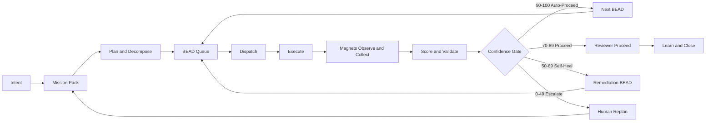
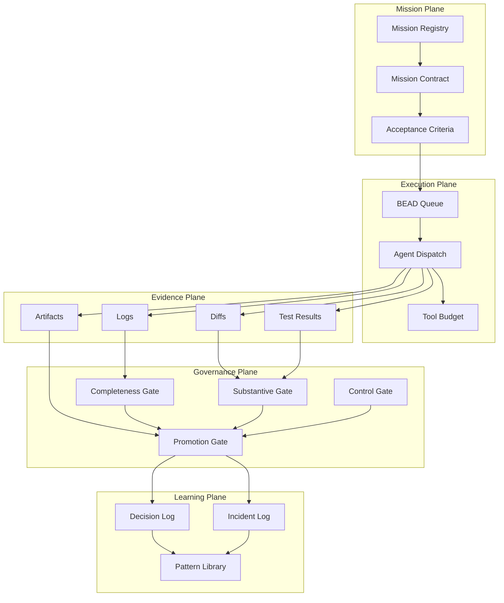
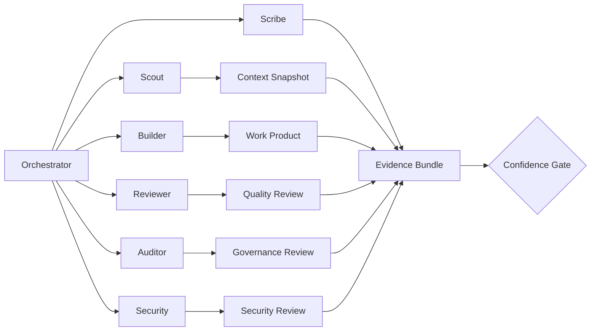
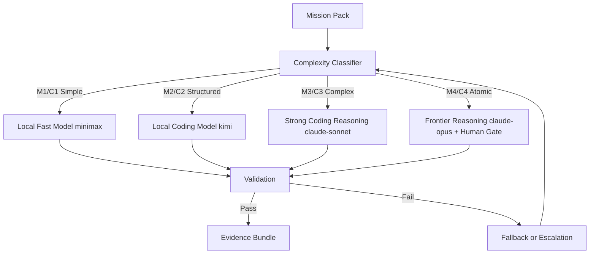
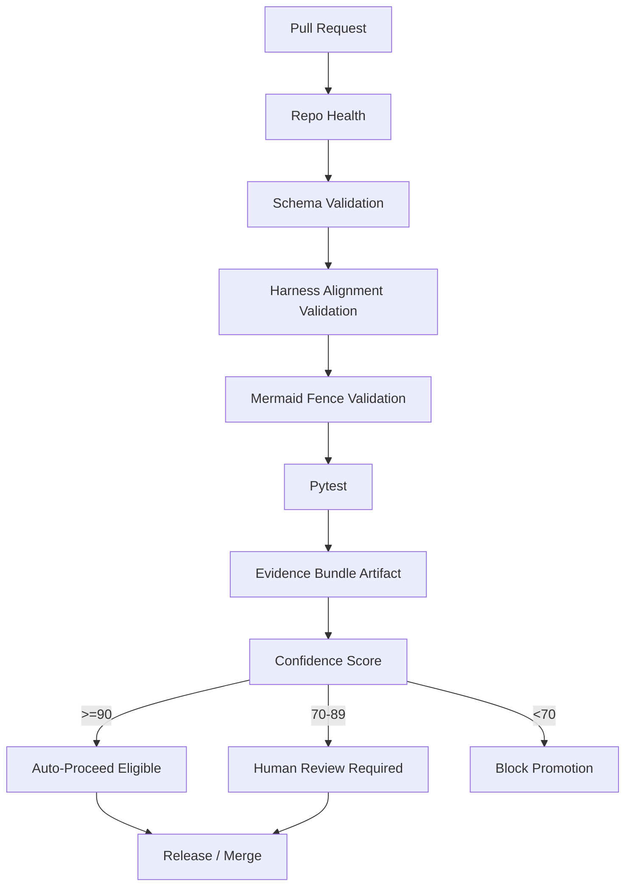
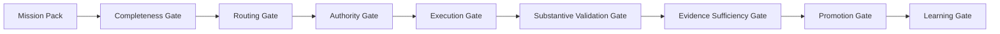

# CAT Mission Pipeline Mermaid Charts

## 1. End-to-end GO-mode pipeline

## 2. Atomic control planes

## 3. Agent orchestration

## 4. LLM/model routing

## 5. CI and CI/CD validation ladder

## 6. Gate stack

