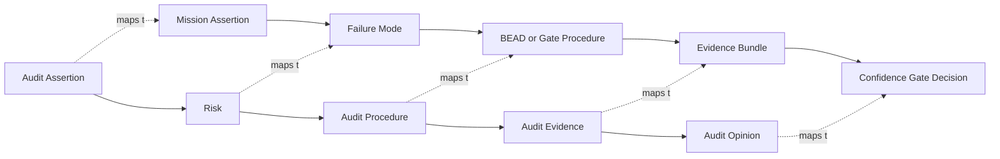

# Harness Engineering Audit Alignment

## Core idea

CPA audit methodology maps cleanly into Chromatic Atomic Tower:

```text
Audit Assertion -> Risk -> Procedure -> Evidence -> Opinion
Mission Assertion -> Failure Mode -> BEAD/Test -> Evidence Bundle -> Confidence Gate
```

CAT is not just an agent runner. It is an audit-governed execution system.

## Harness assertions

| Assertion | Question | Primary gate |
|---|---|---|
| Completeness | Did we capture all mission inputs, files, dependencies, risks, tests, and outputs? | completeness_gate |
| Existence | Do claimed artifacts, logs, commits, and outputs exist? | artifact_gate |
| Accuracy | Are outputs technically and logically correct? | correctness_gate |
| Validity | Was the action relevant, authorized, and inside scope? | control_validation_gate |
| Cutoff / freshness | Did work use current mission and repo state? | state_freshness_gate |
| Classification | Was the mission routed to the right level, agent, and model? | routing_gate |
| Authority | Was the agent allowed to mutate the file or system? | authority_gate |
| Valuation / impact | Is risk, complexity, cost, and impact scored correctly? | impact_gate |
| Presentation | Is the result reviewable and understandable? | reporting_gate |
| Disclosure | Are exceptions, limitations, risks, and unresolved items disclosed? | exception_gate |
| Traceability | Can every result be traced to mission, BEAD, evidence, and gate? | evidence_sufficiency_gate |

## Procedure types

| Audit procedure | CAT equivalent |
|---|---|
| Inquiry | Agent or human clarification |
| Inspection | Review files, diffs, configs, logs, evidence |
| Recalculation | Recompute scores, budgets, metrics |
| Reperformance | Re-run scripts, tests, workflows |
| Confirmation | External API or system state check |
| Analytical procedure | Trend, anomaly, cost, latency, and quality analysis |
| Test of controls | Verify CAT gates operated correctly |
| Substantive test | Verify the output actually works |

## Critical separation

Control validation proves the Harness rails operated correctly.

Substantive validation proves the mission output is correct.

Both are required. A mission can have perfect governance and broken output, or correct output with failed governance. CAT must score them separately.

## Mermaid: audit-to-Harness mapping



## Evidence hierarchy

| Strength | Evidence type |
|---:|---|
| 5 | Passing reproducible tests, CI logs, signed or immutable artifacts |
| 4 | Diffs, schema validation, execution logs, artifact checks |
| 3 | Static analysis, reviewer notes, model self-check with supporting output |
| 2 | Narrative summary with partial supporting evidence |
| 1 | Unsupported agent claim |
| 0 | Missing evidence |

## Confidence score model

```text
confidence =
  0.20 * completeness_score +
  0.25 * substantive_validation_score +
  0.20 * control_validation_score +
  0.15 * evidence_sufficiency_score +
  0.10 * routing_score +
  0.10 * exception_disclosure_score
```

| Score | Decision |
|---:|---|
| 90-100 | Auto-proceed |
| 70-89 | Proceed with reviewer or human approval |
| 50-69 | Caution / self-heal |
| 0-49 | Escalate / replan |

## Canonical rule

```text
Claim -> Procedure -> Evidence -> Gate Decision -> Learning
```
