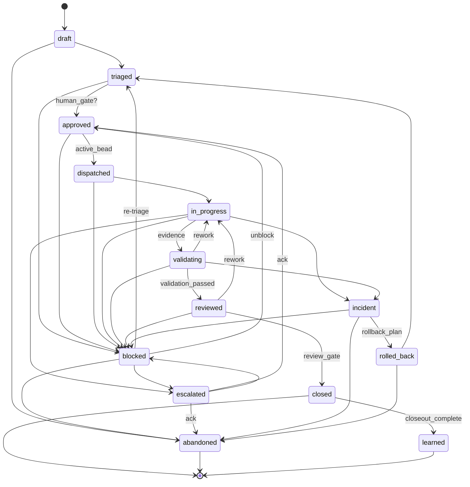
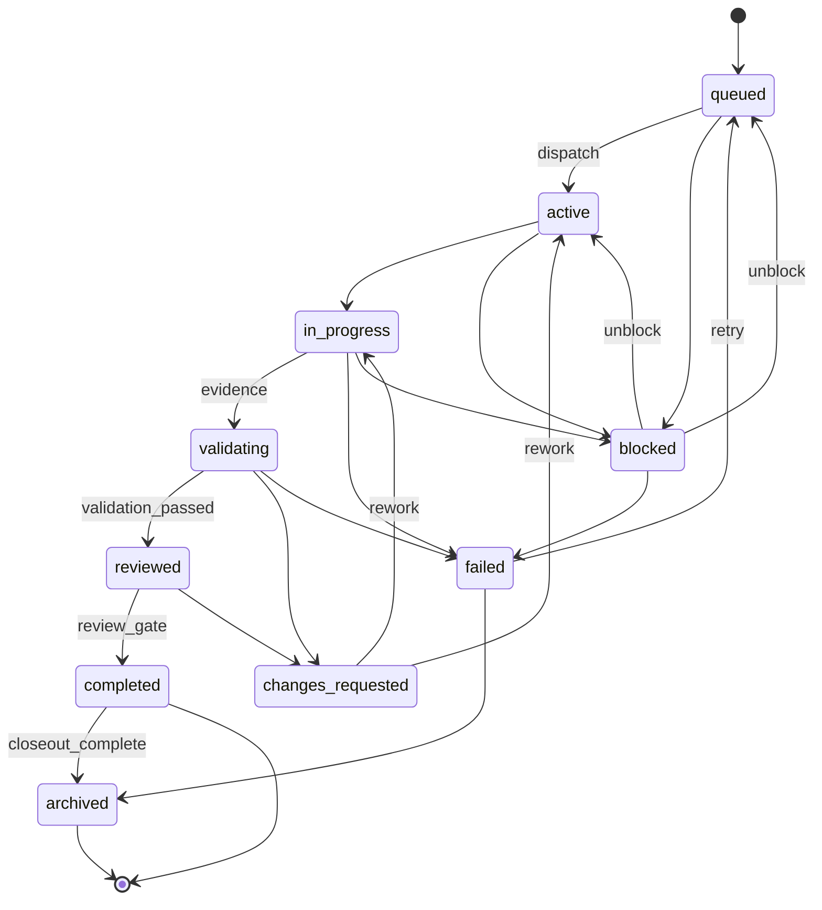

# CAT State Machine

Canonical, machine-checkable transition rules live in
[`gates/state/transition_rules.yaml`](../../gates/state/transition_rules.yaml).
This document is the human-readable rendering of those rules (BEAD-CAT-001-001).
If the two disagree, the YAML wins and this diagram must be regenerated.

**Legend:** solid arc = forward lifecycle progress; arcs labelled `[rework]`,
`[unblock]`, `[retry]`, or `[re-triage]` are reversible loop-backs. Guard names
(e.g. `human_gate`, `review_gate`) are defined in the `guards` block of the YAML.

## Mission lifecycle

States: `draft triaged approved dispatched in_progress validating reviewed closed
blocked escalated rolled_back abandoned incident learned`.
Terminal: `closed` (→ `learned` only), `abandoned`, `learned`.

## BEAD lifecycle

States: `queued active in_progress validating reviewed completed blocked failed
changes_requested archived`. Terminal: `completed` (→ `archived` only), `archived`.

## Enforcement

`scripts/cat_transition.py` (BEAD-CAT-001-002) loads `transition_rules.yaml`,
rejects any unlisted `(from, to)` pair, evaluates the named guard, and records the
transition in `evidence/logs/transitions.jsonl`. This replaces the manual operator
transitions used to close Sprint 000.
